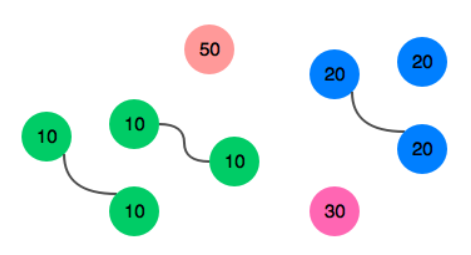

## Sales by match

There is a large pile of socks that must be paired by color. 
Given an array of integers representing the color of each sock, 
determine how many pairs of socks with matching colors there are.

### Example

n = 7
array = [ 1, 2, 1, 2, 1, 3, 2 ]

There is one pair of color 1 and one of color 2. 
There are three odd socks left, one of each color. The number of pairs is 2.

### Function Description

#### Params:
- int n: the number of socks in the pile
- int array[n]: the colors of each sock

#### Returns:
- int: the number of pairs

### Constraints

- 1 <= n <= 100
- 1 <= array[i] <= 100, where 0 <= i <= n

### Explanation

