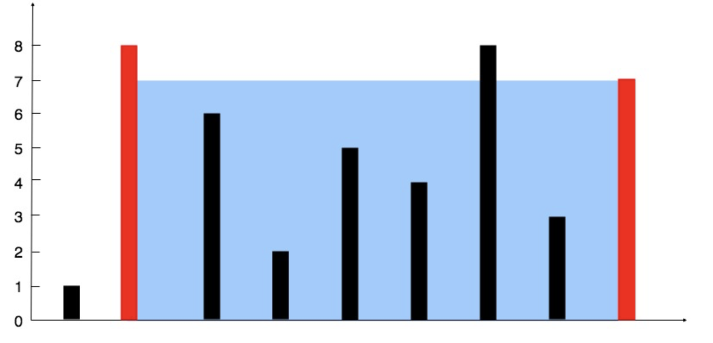

# Container With Most Water

You are given an integer array `height` of length `n`.  
There are `n` vertical lines drawn such that the 2 endpoints of the `i-th` line are `(i, 0)` and `(i, height[i])`.  

Find 2 lines that together with the `x-axis` form a container, such that the container contains the most water.  
Return the maximum amount of water a container can store.  
Notice that you may not slant the container.  

## My Note:

We just need to find the max area of a rectangle formed by two lines and an x-axis.

## Examples

### Example 1:

Input: height = [1,8,6,2,5,4,8,3,7]  
Output: 49  
Explanation:  
The above vertical lines are represented by array [1,8,6,2,5,4,8,3,7].  
In this case, the max area of water (blue section, see the picture) the container can contain is 49.  

## Constraints:

 - `n == height.length`  
 - `2 <= n <= 105`  
 - `0 <= height[i] <= 104`  
